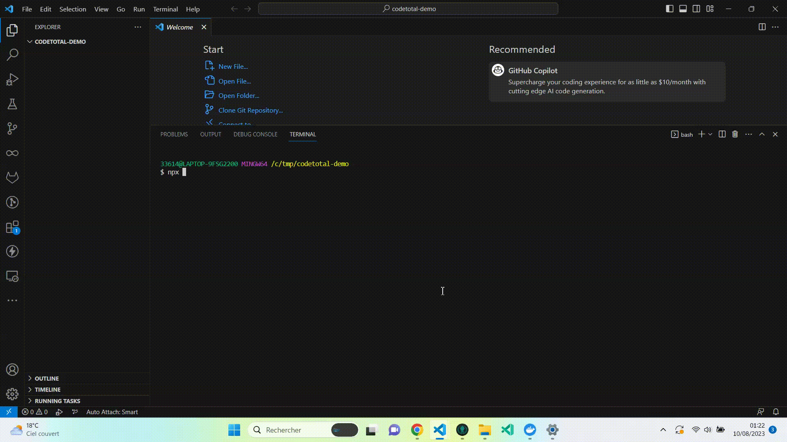

# CodeTotal

**CodeTotal** analyzes any **snippet**, **file**, or **repository** to detect possible **security flaws** such as **secret in code**, **open source vulnerability**, **code security**, **vulnerability**, insecure **infrastructure as code**, and potential **legal issues** with open source licenses.

To see how to use CodeTotal, please read [**online documentation**](https://codetotal.io) :)

TLDR; Just run `npx mega-linter-runner@latest --codetotal`

_Brought to you by [OX Security](https://ox.security), powered by [MegaLinter](https://megalinter.io)_

