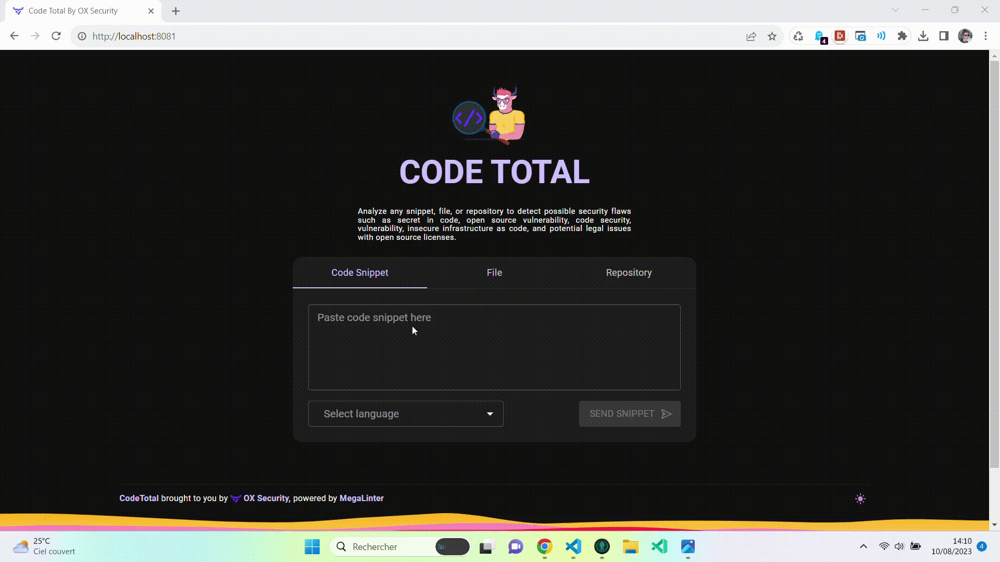

<!-- markdownlint-disable MD013 -->
# CodeTotal

**CodeTotal** analyzes any **snippet**, **file**, or **repository** to detect possible **security flaws** such as **secret in code**, **open source vulnerability**, **code security**, **vulnerability**, insecure **infrastructure as code**, and potential **legal issues** with open source licenses.

[Start now !](quick-start.md)

_Brought to you by [OX Security](https://ox.security), powered by [MegaLinter](https://megalinter.io)_

___

## Scan repository

Scan an entire repository

___

## Scan snippets

Copy-paste a snippet in any language.

___

## Scan file(s)

Select a file to scan, it can be:

- any source code file
- a zip containing a folder that will be extracted before scan.

___

