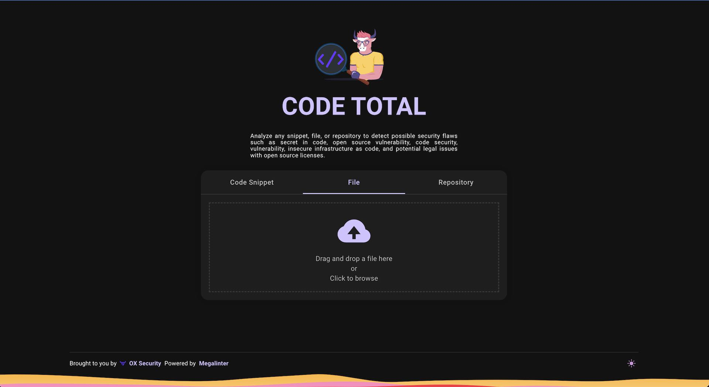

# CodeTotal _(Preview version)_

**CodeTotal** analyzes any **snippet**, **file**, or **repository** to detect possible **security flaws** such as **secret in code**, **open source vulnerability**, **code security**, **vulnerability**, insecure **infrastructure as code**, and potential **legal issues** with open source licenses.

Brought to you by [OX Security](https://ox.security), powered by [MegaLinter](https://megalinter.io)

[Start now !](quick-start.md)