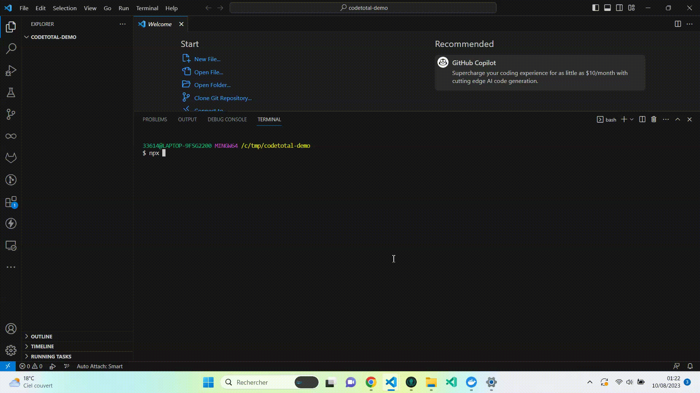

<!-- markdownlint-disable MD013 -->

## Pre-requisites

CodeTotal is based on docker images, so all you need to have is:

- [docker](https://docs.docker.com/engine/install/) installed and started on your computer, so our [docker-compose.yml](https://github.com/oxsecurity/codetotal/blob/main/docker-compose.yml) file can be interpreted.
- [nodejs](https://nodejs.org/en), to call npm startup script

## Single Command

Run `npx mega-linter-runner@latest --codetotal`

## Alternative using repository

### Clone the repository

- Run `git clone https://github.com/oxsecurity/codetotal.git`

### Start CodeTotal

- Run `npm install`

- Run `npm run codetotal`
  - _Alternative: `npm run codetotal:beta` to run beta version_

- Open <http://localhost:8081/> in your Web browser

